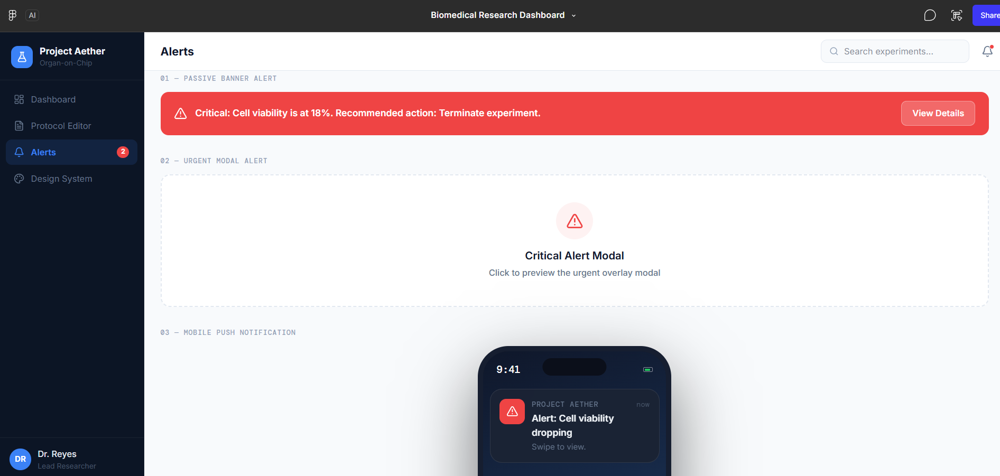

#Project Aether 🧪
A modern UI/UX design for an Organ-on-Chip drug screening platform.**

📖 Overview

Project Aether is a design concept for a laboratory control center used in hepatocyte (liver cell) drug screening. It helps researchers monitor experiments in real-time, automate protocols, and respond to critical alerts instantly.

🎯 The Problem

Scientists often rely on outdated, clunky software to run life-saving experiments. This leads to errors, missed alerts, and wasted time.

💡 The Solution

Live Dashboard – Real-time metrics like cell viability, temperature, and pH
Protocol Editor – Drag-and-drop workflow builder
Alert System – Color-coded alerts for urgent actions
Design System – Consistent typography, colors, and components

🖼️ Screenshots

[Dashboard](dashboard.png)
Live metrics and cell viability tracking

[Protocol Editor](protocol-editor.png)
Drag-and-drop workflow builder

Urgent alerts and notifications

[Design System](design-system.png)
Typography and component library

📄Full PDF: [Download Project Aether PDF](./Project%20Aether%20–%20Organ-on-Chip%20Dashboard.pdf)

Built With

Figma – UI/UX design, prototyping, and design system
Design Tokens – Typography, colors, and spacing
Component Library – Reusable buttons, cards, and alerts

Design System

| Type | Size | Weight |
|------|------|--------|
| H1   | 32px |  700   |
| H2   | 24px |  600   |
| Body | 16px |  400   |
| Small| 14px |  400   |
| Mono | 13px |  500   |

Colors:Green (stable) | Amber (warning) | Red (critical)

👩‍💻 My Role

This was a personal UX/UI design project where I handled research, design, prototyping, and the design system from start to finish.

📬 Connect With Me

LinkedIn: https://www.linkedin.com/in/harini-seenu-1020832b2/
Portfolio: https://harini-s5246.github.io/Portfolio/
Email: hariniseenu24@gmail.com

---

*Always open to feedback and fresh perspectives! 🙏*
